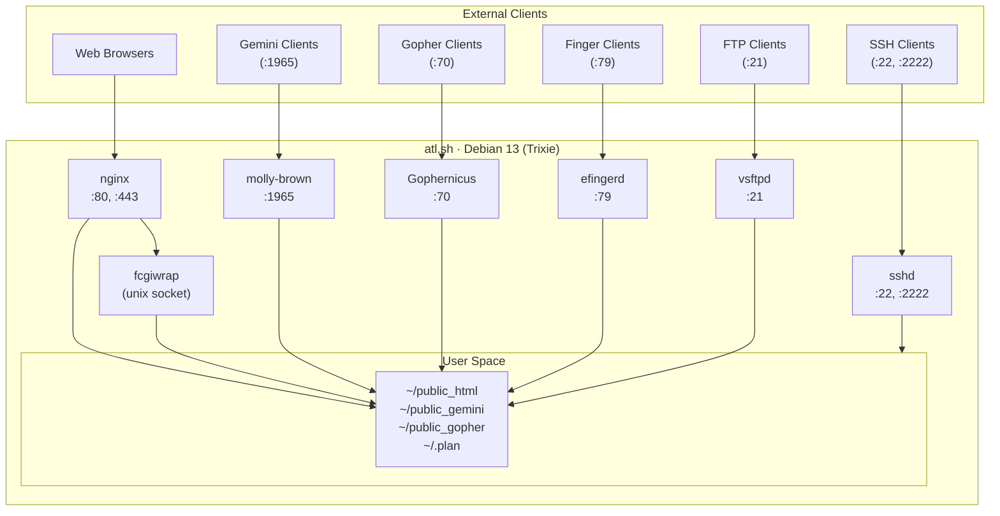
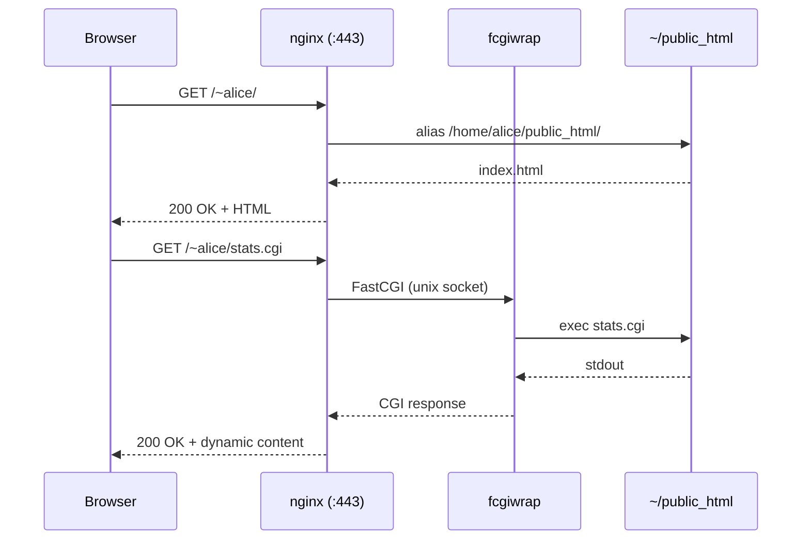
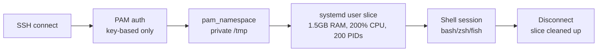

This page describes how atl.sh is built: the infrastructure layer, the
configuration layer managed by Ansible, and the services that run on the server.

## System diagram



## Request flow: web page



## User session lifecycle



## Infrastructure

atl.sh runs on a physical dedicated server hosted by
[Hetzner](https://www.hetzner.com/), with DNS managed through Cloudflare.
The production server is managed manually (bare-metal, not provisioned by
Terraform). Terraform provisions only the staging environment.

| Component    | Provider / Technology               |
|--------------|-------------------------------------|
| Server       | Hetzner dedicated (physical, manual)|
| Staging      | Hetzner Cloud VPS (Terraform)       |
| DNS          | Cloudflare (Terraform)              |
| OS           | Debian 13 (Trixie)                  |
| Config mgmt  | Ansible                             |

### Terraform

Terraform manages the staging VPS and Cloudflare DNS records. Production
infrastructure is bare-metal and not managed by Terraform.

Terraform state is stored in `terraform/terraform.tfstate` (not committed).
Variables live in `terraform/terraform.tfvars` (also not committed — copy from
`terraform.tfvars.example`).

```bash
just tf-init    # initialize backend and download providers
just tf-plan    # preview changes before applying
just tf-apply   # provision or update staging infrastructure
```

The Terraform configuration provisions:

- Hetzner Cloud VPS for staging
- Cloudflare DNS records (`atl.sh`, `staging.atl.sh`, and subdomains)

## Ansible Structure

Configuration management is split into five roles applied by `ansible/site.yml`.
Each role has a focused responsibility and corresponding `--tags` value for
selective runs.

```
ansible/
├── site.yml                   # main playbook
├── inventory/
│   ├── hosts.yml              # dev / staging / prod host groups
│   └── group_vars/
│       └── all/
│           ├── main.yml       # shared variables
│           └── vault.yml      # encrypted secrets (Ansible Vault)
├── playbooks/
│   ├── create-user.yml        # onboard a new pubnix user
│   └── remove-user.yml        # offboard a user
└── roles/
    ├── common/                # apt cache, base packages, NTP, journald
    ├── packages/              # shells, languages, editors, CLI tools, games
    ├── security/              # hardening, SSH, firewall, fail2ban, auditd, AIDE
    ├── users/                 # skel, MOTD, PAM limits, social commands
    ├── environment/           # cgroup limits, quotas, private /tmp, PATH
    ├── services/              # nginx, Gemini, Gopher, finger, dictd, games, webring
    ├── ftp/                   # vsftpd (FTP/S)
    ├── monitoring/            # Prometheus node exporter, smartd, lm-sensors
    └── backup/                # Borgmatic (BorgBackup)
```

### Role: packages

All user-facing software:

- Shells: bash, zsh, fish, mksh, tcsh, ksh93, rc, elvish, nushell, dash
- Nushell installed via Gemfury apt repository (not in Debian repos)
- Editors: vim, neovim, nano, emacs, micro, joe, vis, kakoune
- File managers: ranger, lf, mc, nnn, vifm
- Languages: Python, Node.js, Go, Rust, Ruby, C/C++, Haskell, Elixir, Java, and 20+ more
- CLI tools: ripgrep, fzf, jq, pandoc, miller, taskwarrior, newsboat, sc-im, duf, and many more
- Networking: gping, trippy, xh, drill, prettyping, fping, sipcalc, termshark, speedtest-cli, rclone
- Chat: irssi, weechat, profanity, talk, talkd (with openbsd-inetd)
- Mail: alpine, neomutt, aerc
- Browsers: lynx, w3m, elinks, links, amfora
- Games: nethack, crawl, angband, bsdgames, botany, arcade games
- Fun: fortune, cowsay, figlet, cmatrix, cbonsai, boxes, asciinema, nyancat
- `/etc/shells` registration for all available login shells

### Role: security

Security hardening, split into task files:

- CIS kernel parameter hardening via `sysctl` (ASLR, ptrace restrictions,
  network protections)
- Kernel module blacklisting (uncommon filesystems, protocols)
- Password and sudo policy
- SSH configuration (key-only auth, ports 22 + 2222, `AllowGroups`)
- UFW firewall (allowlist — only required ports open)
- Fail2ban (5 failures in 10 minutes → 1-hour ban)
- Auditd with 40+ rules (identity files, privilege escalation, LOLBins,
  MITRE ATT&CK-tagged syscall rules)
- journald hardening (1 GB cap)
- AIDE file integrity monitoring (daily check at 05:00 UTC)
- Automatic security updates via `unattended-upgrades`
- Malware scanning (`rkhunter`, `chkrootkit`, `lynis`)

### Role: users

Populates the shared user environment:

- `/etc/skel/` — scaffold copied to every new user's home on account creation
- MOTD — welcome message shown on SSH login
- PAM resource limits — per-user caps enforced via `/etc/security/limits.conf`
- Social commands: `menu`, `plan`, `lastplan`, `online`, `community`
- Private `/tmp` via `pam_namespace` polyinstantiation
- Per-user logrotate cron job

### Role: environment

Per-user resource isolation and environment setup:

- **Cgroup v2 user slices** — systemd enforces 1.5 GB RAM, 200% CPU, 200
  process limits per user session
- **Disk quotas** — 5 GB soft / 6 GB hard per user (XFS or ext4 quota)
- **Private `/tmp`** — `pam_namespace` polyinstantiation gives each session
  an isolated tmpdir
- **XDG directories** — `XDG_CONFIG_HOME`, `XDG_CACHE_HOME`, `XDG_DATA_HOME`,
  `XDG_STATE_HOME` all set via `/etc/profile.d/`
- **PATH additions** — `~/.local/bin`, `~/.cargo/bin`, `~/.go/bin`,
  `~/.local/share/gem/bin`, `~/.deno/bin`, and others added at login

### Role: services

All public-facing services and community features:

| Task file      | Service                                              |
|----------------|------------------------------------------------------|
| `web.yml`      | Nginx + fcgiwrap for tilde sites and CGI             |
| `gemini.yml`   | molly-brown Gemini server                            |
| `gopher.yml`   | Gophernicus Gopher server                            |
| `finger.yml`   | efingerd (systemd socket-activated)                  |
| `games.yml`    | NetHack, Botany, Angband, Crawl, arcade games        |
| `webring.yml`  | Self-managing member ring with nginx auto-injection  |
| `dict.yml`     | dictd with 7 offline dictionaries (localhost:2628)   |

## Network

### Open Ports

| Port(s)       | Protocol | Service                         |
|---------------|----------|---------------------------------|
| 22, 2222      | TCP      | SSH                             |
| 70            | TCP      | Gopher                          |
| 79            | TCP      | Finger                          |
| 80            | TCP      | HTTP (nginx)                    |
| 443           | TCP      | HTTPS (nginx + Cloudflare)      |
| 1965          | TCP      | Gemini                          |
| 21            | TCP      | FTP control (vsftpd)            |
| 40000–40100   | TCP      | FTP passive data                |

All other ports are blocked by UFW. SSH is additionally protected by Fail2ban
rate limiting.

### Internal Services

| Service         | Bind address       | Notes                              |
|-----------------|--------------------|------------------------------------|
| Node Exporter   | `127.0.0.1:9100`   | Prometheus metrics, not public     |
| dictd           | `127.0.0.1:2628`   | Dictionary server (RFC 2229)       |
| talkd           | `0.0.0.0:517-518`  | Talk daemon via inetd, UFW blocked |
| fcgiwrap        | Unix socket        | CGI execution for tilde sites      |
| molly-brown     | `0.0.0.0:1965`     | Gemini TLS server                  |
| Gophernicus     | `0.0.0.0:70`       | Gopher server                      |
| efingerd        | systemd socket     | Finger protocol, socket-activated  |

## Tilde Web Architecture

Each user's `~/public_html/` is served at `https://atl.sh/~username/` via nginx.

```
nginx (443)
  └── location ~ ^/~([^/]+)
        root /home/$1/public_html
        fcgiwrap for *.cgi, *.pl, *.py scripts
        sub_filter </body> → webring widget injection
```

CGI scripts in `public_html/` execute as the user's UID via fcgiwrap with
suexec-style per-user wrappers.

The webring lives at `/var/www/html/ring/`:

- `go.cgi` — Python CGI for next/prev/random navigation
- `members.json` — generated every 15 minutes by a cron job scanning `~/.ring` files
- `widget.js` — auto-injected into all tilde pages via nginx `sub_filter`

## Environments

Three environments share the same Ansible playbook and roles:

| Environment | Infrastructure                  | Purpose                              |
|-------------|----------------------------------|--------------------------------------|
| `dev`       | Local Vagrant VM                 | Ansible development and testing      |
| `staging`   | Hetzner Cloud VPS (Terraform)    | Pre-production validation            |
| `prod`      | Hetzner dedicated (bare-metal)   | Live production system               |

All three run Debian 13 (Trixie) and use the full playbook including security
hardening and quotas, so dev closely mirrors production. See
[Local Development](testing) for dev environment setup.
